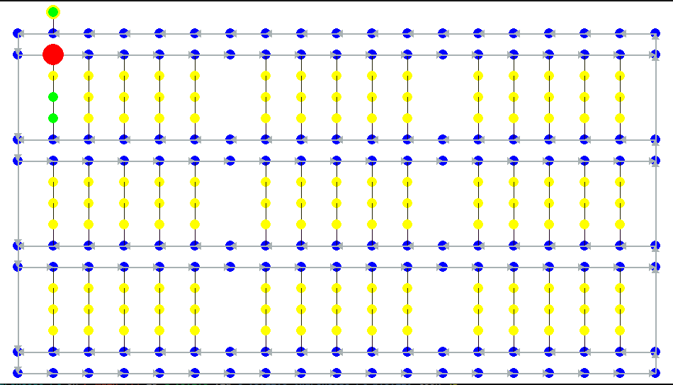

# Reinforcement learning environment for robots in warehouse
Currently under development: training a single robot to fully fill an empty warehouse with parcels generated from the 'depalletize' gate.
# Not even close :)
