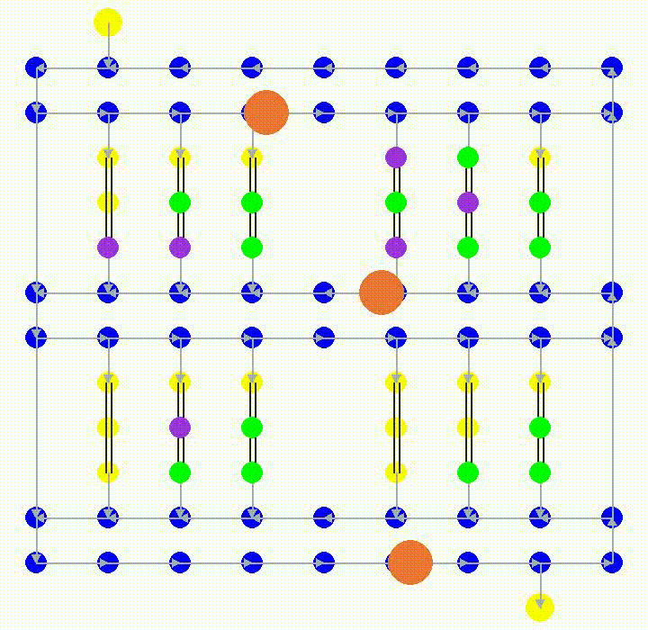

# Multi-agent reinforcement learning environment for shuttles in warehouse
Decentralized [DQN](https://arxiv.org/pdf/1312.5602) training for two types of shuttle: 
- The one that fills the warehouse with parcels from the depalletizer node:

- And the one who picks the requested parcel to palletizer node:

## Good news:
- It works for simple case now.

## Bad news:
- Shuttle of one type only do its particular task.
- Currently, they perform their tasks only within their own environments and optimize only their own rewards.
- No additional requested parcel during enviroment running.
- There are many points to address and optimizations to make.

## This is my note, don't mind
- If the observation is a flattened vector of environment details, we must decide what information to include and in what form it should be represented, but in return, the agent learns more easily. If we simply forward the frame to agent, above problem doesn't bother us, but the agent have to do more works. Can we combine both approaches? Which parts of the work should we do, and which parts should we let the agent handle?
- Which action should we allow the agent to do? Giving the agent more control can lead to better results, but it also makes learning harder.
- Agent learning: Algorithm? Decentralized or centralized approach? Network architecture?